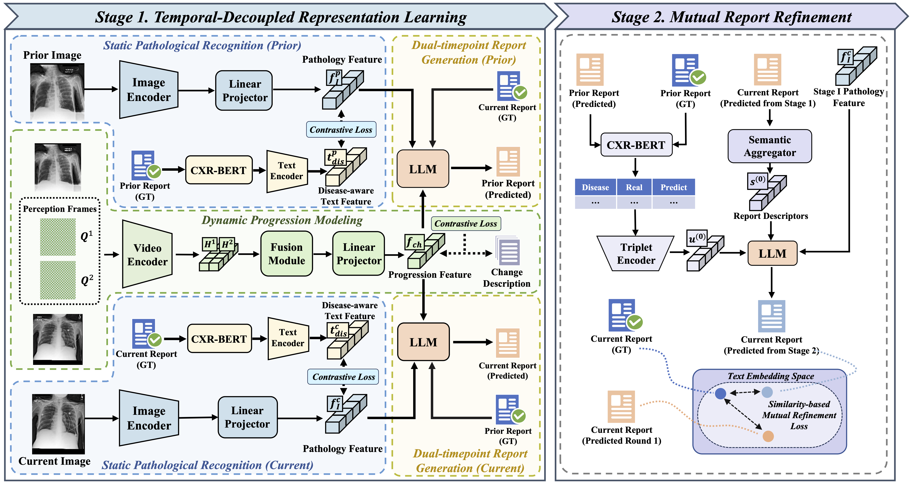

# TIM （CVPR 2026）

Welcome! This repository provides the official implementation of our paper *TIM: Temporal Decoupling with Iterative Mutual-Refinement Model for Longitudinal Radiology Report Generation*

Yiheng Dong, Yi Lin, Shilong Huang, Xiyan Yang, Xin Yang

## Abstract

In this work, we propose a Temporal Decoupling with Iterative Mutual-Refinement Model (TIM), a two-stage framework that explicitly decouples spatial pathology from temporal progression and iteratively refines reports through mutual feedback. Stage I performs temporal-decoupled representation learning, separating temporal evolution patterns from disease-specific features and generating radiology reports for both prior and current studies.  Stage II introduces a mutual report refinement mechanism that identifies diagnostic inconsistencies within prior reports and iteratively rectifies both prior and current reports through error-sensitive feedback. 




## Getting Started

### Installation

```shell
conda create -n TIM python=3.9
conda activate TIM
pip install -r requirements.txt
```

### Required Data

Mimic-cxr: you can download our preprocess annotation file from [here](https://drive.google.com/file/d/14689ztodTtrQJYs--ihB_hgsPMMNHX-H/view?usp=sharing) and download the images from [official website](https://physionet.org/content/mimic-cxr-jpg/2.0.0/)

### Training

Our training strategy consists of two stages:
    
- Stage I: Temporal-decoupled Representation Learning

    ```shell
    sh scripts/stage1_train.sh
    ```

- Stage II: Mutual Report Refinement

     ```shell
     sh scripts/stage2_train.sh
     ```

## Acknowledgement

This project is based on [R2GenGPT](https://github.com/wang-zhanyu/r2gengpt), we thank the original authors for their excellent work.


## Citation

If you find this project useful, please consider citing:

```
@inproceedings{dong2026tim,
  title={TIM: Temporal Decoupling with Iterative Mutual-Refinement Model for Longitudinal Radiology Report Generation},
  author={Dong, Yiheng and Lin, Yi and Huang, Shilong and Yang, Xiyan and Yang, Xin},
  booktitle={Proceedings of the IEEE/CVF Conference on Computer Vision and Pattern Recognition},
  pages={6951--6961},
  year={2026}
}
```